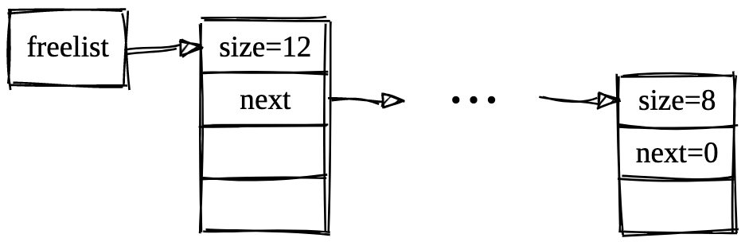

1. Внимательно читаем условие

```
main.c
======

struct block* freelist;

alloc.c
========
struct block {
    size_t size;
    struct block* next;
};

void *alloc_mem(size_t size) {
	//...
	// что-то с freelist
	//...
	void* p = sbrk(size);
	//...
	return p;
}

void free_mem(void *ptr) {
	//...
	// что-то с freelist
}
```

Почему просто нельзя просто все время вызывать sbrk (и не использовать freelist вообще)?

```
p1 = malloc(100);
p2 = malloc(200);
free(p1);
p3 = malloc(100); // вот тут разумно разместить память для p3 на месте p1,
				  // а не после p2 (как будет при использовании только sbrk)
free(p2);
free(p3);
```

2. Читаем еще раз внимательней:

```
Если в списке есть блоки, у которых записанный размер не меньше size, alloc_mem
  должна удалить первый такой блок из списка и вернуть вызывающей подпрограмме адрес тела этого блока
  (адрес блока, увеличенный на 8)
```
```
Если в списке freelist подходящих блоков нет, то alloc_mem использует
функцию sbrk, чтобы запросить у системы 8 + actual_size байт
дополнительной памяти.
```

Почему здесь везде 8?!

```
Если sbrk отработал успешно, то alloc_mem записывает actual_size в первое машинное слово
полученного участка памяти и возвращает адрес второго машинного слова.
```

НЕТ ОТДЕЛЬНОЙ СТРУКТУРЫ ПАМЯТИ ДЛЯ ХРАНЕНИЯ ИНФОРМАЦИИ О СВОБОДНЫХ БЛОКАХ!
Т.Е. информация из block хранится в выделенном участке памяти.


```
void *alloc_mem(size_t size) {
	// что-то с freelist
	void* p = sbrk(size);
	struct block *bp = (void *)p;
	bp->size = size;
	...
	return p;
}
```
NB: внимательно, в функции alloc_mem +8 и -8 не учтено

```
void free_mem(void *ptr) {
	...
	// что-то с freelist
	struct block *bp = (void *)p;
    bp->next = ... // добавляем блок в список свободных блоков
    ...
}
```
NB: внимательно, в функции free_mem +8 и -8 не учтено

3. Если выделить память не удалось (результат sbrk -1), то alloc_mem должна вернутьт NULL

```
void* p = sbrk(size);
if (сравнить p и -1)
```

4. [sbrk wiki](https://en.wikipedia.org/wiki/Sbrk)
```
sbrk is used to adjust the program break value by adding a possibly negative size,
```
Делать сложную реализацию, которая использует такую возможность (уменьшение выделенного объема памяти) не требуется.


