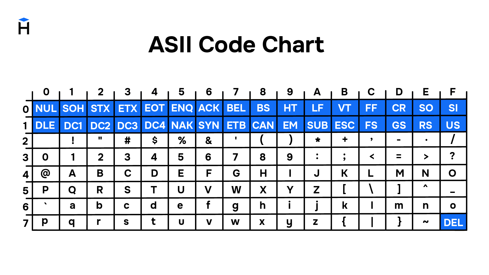
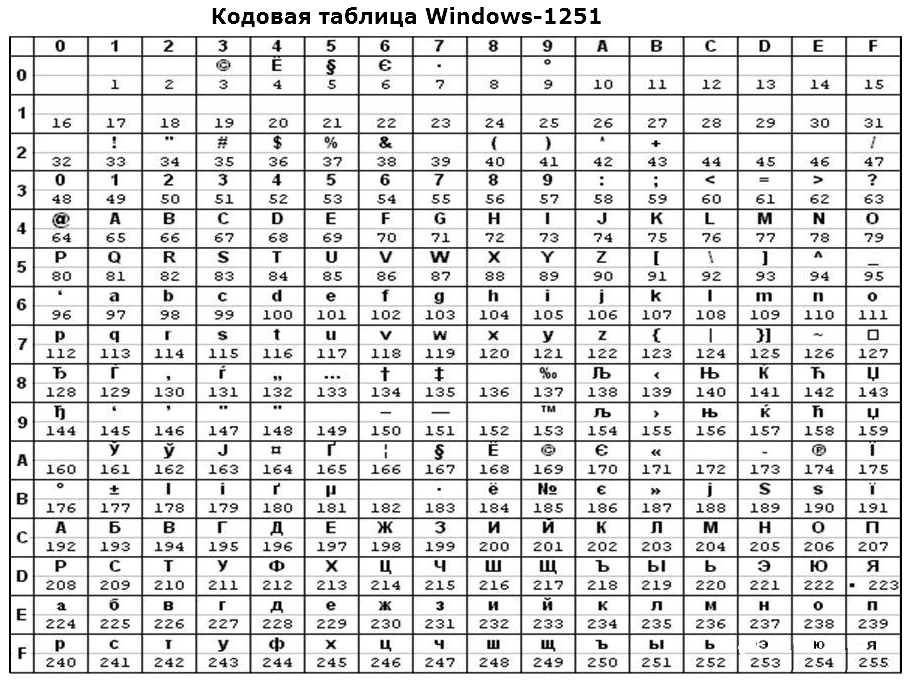
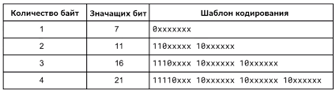

* лока́ль (от англ. locale) --- набор параметров, определяющий
  региональные настройки пользовательского интерфейса,  такие как язык, страна, часовой пояс,
  набор символов, формат вывода даты, времени, используемая денежная единица и пр.
    * `locale` -- посмотреть locale
* настройка терминала: Gnome Terminal --> Preferences --> Profiles --> Compatibility --> Encoding
* ASCII (0..127),  `print_ascii.c`

* CP1251 (127..255)

* KOI8-R (127..255), `print_koi8r.c`

* [Unicode](https://symbl.cc/en/unicode-table/)
    * BOM (Byte Order Mark) — это специальный символ Unicode (U+FEFF), который используется для обозначения порядка байт. Он представляет собой невидимый символ, который помогает программам определять, в каком порядке считываются байты в многобайтовом представлении символов.

    * [Complex Emoji](https://unicode.link/sequences)

* UTF-8

