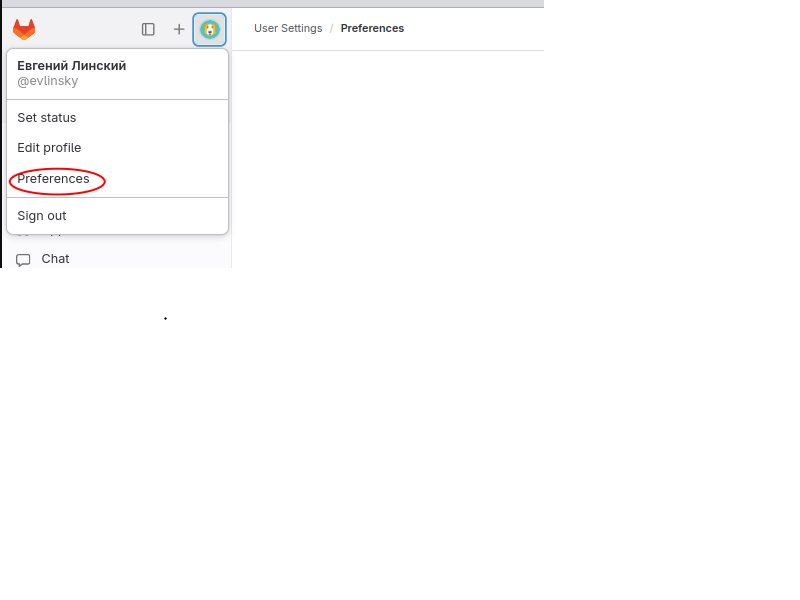
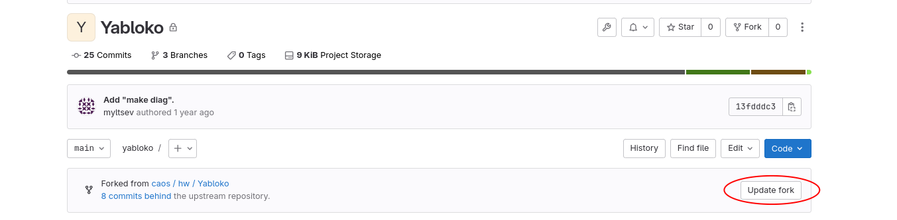

* Типовой сценарий 1
	* Схема
		```
		Developer 1  <-----------> 
									Repo (gitlab, github)
		Developer 2  <----------->
		```

	* Цикл работы
		```
		// Первый раз
		git clone {url}

		```
		```
		// Цикл работы:
		git pull --rebase
		git add file.c
		git commit
		git push origin main:main
		// если сервер не дал выполнить предыдущую команду, то
		// * забрать изменения, которые внесли с последнего git pull --rebase
		// * разрешить конфликты, т.е. опять выполнить:
		git pull --rebase 
		git push origin main:main
		```
	* Не хватает code review, continious integration (автотесты, юнит тесты)
	```
		int sum(int a, int b) {
			return a + b;
		}

		int test_sum() {
			if (sum(2, 3) == 5)
				return 0;
			else
				return 1;
		}
	```

* Типовой сценарий 2: Pull request (git hub), Merge request (git lab)
	* Цикл работы
		```
		// Первый раз
		git clone {url}

		```
		```
		// Цикл работы:
		git pull --rebase
		git add file.c
		git commit
		git push origin main:add_hello // local branch:server branch
		// в графическом интерфейсе браузера: merge request add_hello to main
		// т.е. запрос на включение своих изменений в основную ветку репозитория
		```
	* При появлении merge request запускаются автотесты (continious integration), ответственный приходит читать код и оставлять комментарии

* Типовой сценарий 3: upstream и origin
	* пусть есть известный проект gcc: http://github.com/gnu/gcc
    * в графическом интерфейса надо сделать копию (fork) репозитария: http://github.com/elinsky/gcc
    	* http://github.com/gnu/gcc -- upstream
		* http://github.com/elinsky/gcc -- origin

	* сначала можно вести разработку в http://github.com/elinsky/gcc
	* когда feature готова сделать merge request/pull request --> между origin и upstream репозитариями
	
* Возможны и другие сценарии. YABLOKO:
	* fork публичного репозитория  gitlab.myltsev.ru/caos/hw/yabloko/  в свой приватный репозиторий
	* git push в нужную ветку своего репозитория
	* merge requests не используются

* Что сделать, чтобы не вводить каждый раз пароль?
	* ssh-keygen -t rsa -b 4096 -C "{email}"
			* команда генерирует sgg ключи
			* {email} = емейл, которым вы пользуетесь в https://gitlab.myltsev.ru/caos
	* Зайти в настройки 
	* SSH keys --> Add new key
	* Скопировать содержимое файла ~/.ssh/id_rsa.pub
	* Чтобы сработало, надо склонить (clone) по протоколу ssh (git@gitlab.myltsev.ru:{user}/yabloko.git)

* Не забывайте обновлять свой fork из upstream
	* Через графический интерфейс 
		* Но можно и через CLI
		```
		git remote add upstream https://gitlab.myltsev.ru/caos/hw/yabloko
		git fetch upstream
		git checkout main
		git pull upstream main
		git push origin main
		```
	* Потом git pull --rebase


