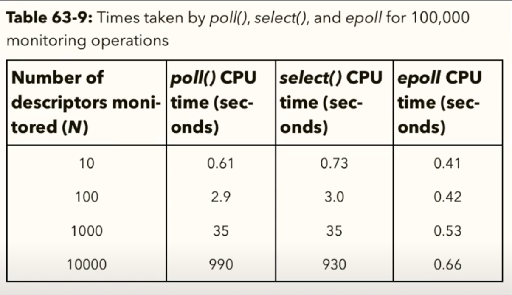

* 01-read-pipes.c
    * mkfifo ch1 ch2
    * ./01-read-pipes.elf ch1 ch2
    * cat > ch1
    * cat > ch2
    * Ctrl + D = EOF
    * blocking: попробуйте сначала в ch2, потом в ch1
    * non-blocking: htop: F4 or \, посмотреть utilization
* 02-select-pipes.c
    * kernel_space <--> user_space информация обо всех дескрипторах
    ```
       fdset {
          info array[10000];
          ...
       };

       struct info {
           ...
           bool have_new_bytes;
       }

       array[fd] -- данные про дескриптор fd
    ```
* 4-epoll-server.c
    * nc localhost 33333
    * nc localhost 33333
    * EPOLLHUP --- событие <<закрытие сокета>>
    * kernel_space <--> user_space информация событиях (в событии есть информация о дескрипторе)
    * если событий меньше чем дескрипторов, то epoll эффективней select
    * 
